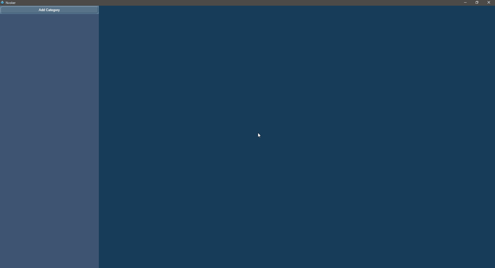
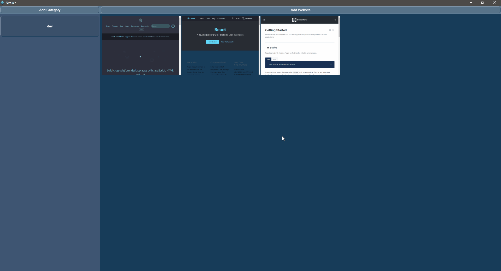

# Nvoker

    

Nvoker is as Speed Dial built on [Electron](https://github.com/electron/electron) (using [Electron Forge](https://github.com/electron-userland/electron-forge)) and [React](https://github.com/facebook/react). It allows you to quickly access you favorite websites, by saving them as images in your own categories.

## General Usage

To start adding links, a category must first be created. After a category has been created and selected, you can start adding links to that category by providing its URL. Left clicking on a link will open that link in your default browser, while right clicking will copy the URL to clipboard. You can create any number of categories and links, so feel free to add as many as you wish.  
Navigation of categories and links can be done either by using the mouse wheel, or by clicking and dragging the mouse.  
Deleting links or categories can be done by clicking and holding on an element that you want to delete, which will bring a menu to delete items of that type (category or link). After the menu appears, you may select any number of elements of that type to delete, and the confirm your selection.

## Settings and Customization

All files generated by Nvoker are saved in the `UserData` directory, which is created in the root directory of the executable.

### Settings

`Settings.json` has 3 basic settings:

1. `window` settings: Consists of window `bounds`, which are saved every time Nvoker is closed along with `isMaximized`, and `minWidth` and `minHeight`, which you can change as you see fit.
2. `snapshot` settings: consists of `width` and `height`, to determine the size of the image created when saving a link, and `timeout`, which allows setting a delay before a screenshot of the page is taken. This is useful in cases where the screenshot is taken before a page is fully loaded.
3. `showNotifications` setting: Allows enabling/disabling notifications when link creation fails.

### Customization

You may modify the appearance of Nvoker, by creating a file named `styles.css` in the `UserData` directory with your desired styles. By default, Nvoker has its own styles defined. To get and override those styles, consult the building section below.

## Building

Before building Nvoker, please make sure you have [Node](https://nodejs.org/) and [npm](https://www.npmjs.com/) installed. If both are installed, you can do the following to build from source:

1. Clone or download and extract this repository.
2. Open a terminal, and `cd` to the folder you have cloned or extracted this repository.
3. Run `npm install` to download required dependencies.
4. Run `npm run make` to build Nvoker. This will create an `out` directory with all the files required to install/run Nvoker.
5. (Optional) Run `npm run concat-css` (on macOS/Linux) or `npm run concat-css-win` (on Windows) to generate a styles.css file in the `out` directory. This file has all the default styles of Nvoker, which you can modify and place in the `UserData` directory of Nvoker.

## Demos

    
Adding Categories and Links

    

    
Opening Links

    

    
Deleting Categories and Links

    

 

## License

[MIT License](https://github.com/SASUPERNOVA/nvoker/blob/master/License.md)

